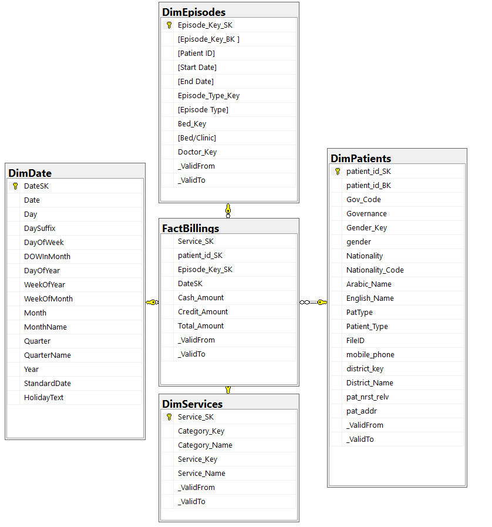
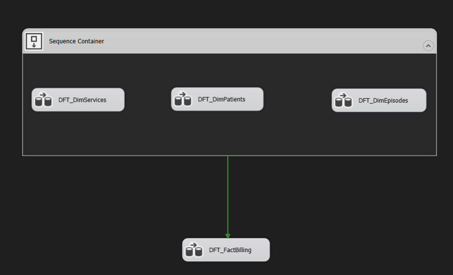

## Description
This project involves designing a data warehouse and developing an ETL (Extract, Transform, Load) process to populate the warehouse with data from Excel files. The dataset includes information about billing, patient episodes, patients, and services.

## Requirements
- SQL Server
- SQL Server Integration Services (SSIS)
- Microsoft Excel

## Getting Started
1. **Clone the repository:**
    ```bash
    git clone https://github.com/Mohamed-Ahmed-Ali/lab1-data-warehouse-etl.git
    cd lab1-data-warehouse-etl
    ```
2. **Follow the steps in the [Requirements](#requirements) section to set up the necessary tools and databases.**
3. **Execute the SQL scripts in the `ddl_scripts` folder to create the data warehouse tables.**
4. **Open and run the SSIS project in the `etl_process` folder to populate the data from Excel files to the data warehouse.**

## Folder Structure
- `ddl_scripts`: Contains DDL SQL scripts for creating the data warehouse tables.
- `etl_process`: Contains the SSIS project for ETL processes.
- `screenshots`: Contains screenshots of the output at various stages.

## Task Requirements
### 1. Design a Data Warehouse
   - Execute the DDL statements in the following order:
      1. `01_CreateDimDate.sql`: Creates the date dimension table.
      2. `02_DwhDdl.sql`: Creates the data warehouse table.

### 2. Define which type of data warehouse is used in your solution, and why.
   - **Type Used:** Star Schema
   - **Explanation:** Chosen for its simplicity and ease of query optimization. Star schemas are well-suited for analytical queries involving facts and dimensions.

### 3. Define a method to check and maintain the integrity between the fact and the dimensions (SQL).
   - Integrity checks are implemented using foreign key constraints in the DDL scripts.

### 4. Add a date dimension to the system to track historical changes.
   - A date dimension (`dim_date`) is added to track historical changes in the system, supporting time-based analysis.

### 5. Design an SSIS project to populate the data from Excel files into the data warehouse.
   - The SSIS project in `etl_process` extracts and transforms data from Excel files to the data warehouse.

## Screenshots



## Contributing
If you'd like to contribute to the project, please follow the standard GitHub flow:
1. Fork the repository.
2. Create a new branch for your feature or bug fix.
3. Make your changes and submit a pull request.
